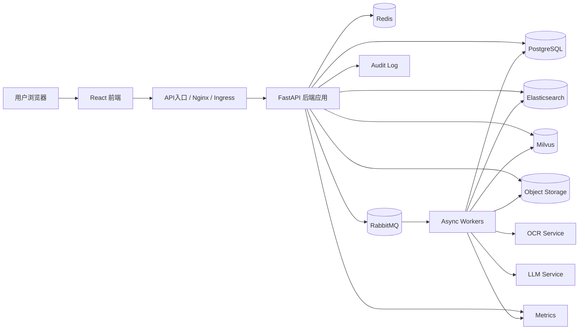
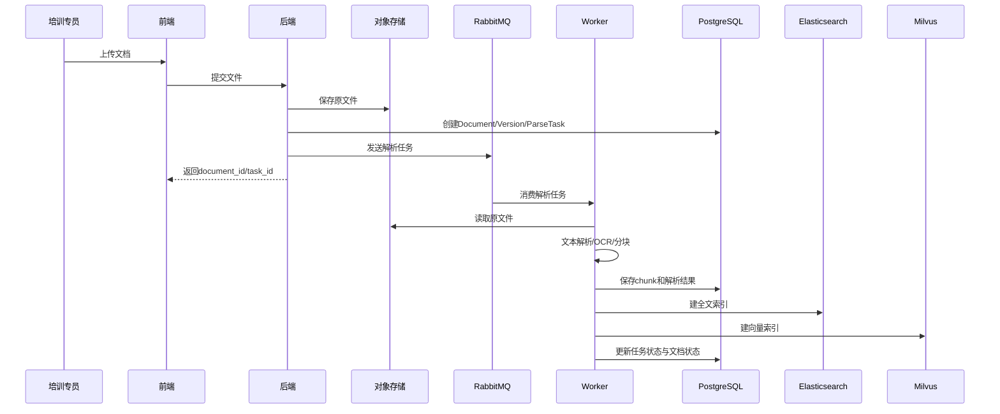

# 内部培训考试系统——总体架构设计文档（初稿）

文档名称：内部培训考试系统总体架构设计文档
版本号：v0.1
日期：2026-03-09
依据文档：PRD v2.0
状态：架构初稿，可进入详细设计阶段

------

# 1. 文档目标

本文档用于明确系统的一期总体技术架构、模块边界、核心数据流、部署方式、非功能设计原则与扩展边界，为以下后续文档提供基础：

1. 详细数据模型设计文档
2. OpenAPI 接口设计文档
3. 前端页面与交互规格文档
4. AI 处理链路设计文档
5. 数据库 Schema 与迁移脚本
6. 异步任务设计文档
7. 面向 agent 的开发任务拆分文档

------

# 2. 架构目标与设计原则

## 2.1 架构目标

一期架构的核心目标不是“技术先进”，而是：

1. **能落地**：优先保证系统能完整跑通“文档入库 → 内容生成 → 审核 → 发布 → 学习考试”闭环
2. **能控复杂度**：把 AI、审核、考试等高复杂链路拆成独立模块
3. **能追溯**：所有关键动作、版本、异步任务、审核操作都能追踪
4. **能扩展**：为后续 SSO、多租户、高级防作弊、图谱、主观题自动评分预留边界
5. **能被 agent 开发**：模块清晰、边界明确、接口可定义、任务可拆分

------

## 2.2 设计原则

### 原则1：前后端分离

前端只负责界面和交互，后端负责业务编排与数据一致性。

### 原则2：事务系统与 AI 处理解耦

AI 调用、OCR、索引构建全部走异步任务，不阻塞主业务请求。

### 原则3：版本优先

课程、题目、文档解析结果必须版本化，禁止直接覆盖已发布或已提交审核的数据。

### 原则4：状态机驱动

审核、发布、考试、异步任务等核心流程全部基于明确状态机，不用隐式逻辑。

### 原则5：检索与事务分离

PostgreSQL 负责事务和主数据；Elasticsearch 和 Milvus 分别负责全文和向量检索。

### 原则6：对象存储与结构化数据分离

原始文档和中间产物单独存储，数据库只保留索引和元数据。

### 原则7：可审计

上传、解析、生成、审核、发布、回滚、交卷、判分都必须有审计记录。

------

# 3. 总体架构概览

------

## 3.1 总体分层

系统采用 6 层结构：

1. **接入层**
   - Web 前端
   - API 网关入口（可由 Nginx / Ingress 实现）
2. **业务应用层**
   - 用户权限服务
   - 文档知识库服务
   - 知识点服务
   - 课程服务
   - 题库服务
   - 审核发布服务
   - 培训任务服务
   - 考试服务
   - 统计审计服务
3. **AI 编排层**
   - 文档解析编排
   - 知识点抽取编排
   - 课程生成编排
   - 题目生成编排
   - 相似度检查编排
4. **异步任务层**
   - RabbitMQ 消息队列
   - Worker 消费者
   - 任务状态管理
5. **数据与检索层**
   - PostgreSQL
   - Redis
   - Elasticsearch
   - Milvus
   - 对象存储（建议 MinIO / S3 兼容）
6. **运维观测层**
   - Prometheus
   - Grafana
   - ELK / OpenSearch Log
   - 审计日志存储

------

## 3.2 总体组件关系图（逻辑）



------

# 4. 技术选型与理由

## 4.1 前端

### 技术栈

- React 18
- TypeScript
- Ant Design 5
- Redux Toolkit
- Vite

### 选型理由

1. 中后台场景成熟
2. 表单、表格、审批、列表、富交互页面适配度高
3. 便于 agent 生成标准化页面骨架
4. 组件生态丰富，利于快速落地

------

## 4.2 后端

### 技术栈

- Python 3.11
- FastAPI
- SQLAlchemy
- Alembic
- Pydantic

### 选型理由

1. 与 AI 能力集成自然
2. FastAPI 对 OpenAPI 生成友好
3. Pydantic 适合定义严格输入输出 schema
4. 有利于 agent 按模块自动生成接口、模型、校验器

------

## 4.3 数据与中间件

### PostgreSQL 15

用途：

- 用户、权限、课程、题目、审核、培训任务、考试、成绩、审计等主事务数据

理由：

- 强事务
- JSONB 可做部分扩展字段
- 一期足够承载复杂业务对象

### Redis 7

用途：

- 会话/Token 辅助
- 热点缓存
- 考试倒计时和状态缓存
- 异步任务中间状态辅助

### Elasticsearch 8

用途：

- 文档全文检索
- 课程/题目全文搜索
- 审核和管理台检索增强

### Milvus

用途：

- 文档 chunk 向量检索
- 相似题检测
- 知识点相关检索

### RabbitMQ

用途：

- 文档解析
- OCR
- 向量化
- 课程生成
- 题目生成
- 相似度检测
- 统计重算等异步任务

### 对象存储

建议：

- S3 兼容接口
- 开发环境可用 MinIO
- 生产环境可对接企业对象存储

用途：

- 原始文档
- 文档抽取中间结果
- 解析产物
- 导出文件
- 大文本或临时包

------

## 4.4 AI 服务

### 一期策略

采用 **独立 AI Service**，通过 OpenAI Compatible API 统一调用大模型。

### 理由

1. 与主业务服务解耦
2. 未来可替换模型供应方而不改业务逻辑
3. 便于统一管理 prompt、超时、重试、限流、日志

------

# 5. 系统模块划分

一期系统拆成 9 个逻辑模块。
注意：**逻辑模块 ≠ 必须拆成 9 个物理微服务**。
一期建议先做 **模块化单体 + 独立 AI Worker**，避免微服务过早复杂化。

------

## 5.1 模块清单

### M1. 用户与权限模块

职责：

- 用户管理
- 角色管理
- 权限校验
- 部门关系管理

不负责：

- 组织外部同步
- SSO 对接

------

### M2. 文档知识库模块

职责：

- 文档上传
- 文档版本管理
- 文档解析任务发起
- 文档结果查看
- 文档检索与预览

不负责：

- 复杂图谱计算
- 高级语义推理

------

### M3. 知识点模块

职责：

- 候选知识点抽取结果管理
- 知识点确认、编辑、合并、停用
- 知识点关联维护

不负责：

- 图数据库复杂查询

------

### M4. 课程模块

职责：

- 课程草稿生成
- 课程编辑
- 课程版本管理
- 课程知识点映射

------

### M5. 题库模块

职责：

- 题目草稿生成
- 题目编辑
- 题库管理
- 相似题基础检测

------

### M6. 审核与发布模块

职责：

- 审核任务生成与流转
- 审核意见
- 发布管理
- 回滚管理

------

### M7. 培训任务模块

职责：

- 培训任务创建
- 范围分配
- 学习期限管理
- 补考规则管理
- 任务完成追踪

------

### M8. 考试模块

职责：

- 试卷创建
- 组卷
- 考试作答会话
- 自动判分
- 成绩记录
- 切屏事件留痕

------

### M9. 统计与审计模块

职责：

- 培训完成率统计
- 学习进度统计
- 成绩统计
- 审计日志检索

------

# 6. 部署形态建议

------

## 6.1 一期建议：模块化单体 + 异步 Worker

这是最关键的架构决策。

### 不建议一期直接上微服务

原因：

1. 业务边界还在快速收敛中
2. 审核、课程、考试之间关联重
3. 开发与部署复杂度会过早上升
4. agent 生成代码时容易被跨服务调用拖乱

### 建议形态

- 1 个主业务应用（FastAPI）
- 1 组异步 Worker
- 1 个 AI Service 封装模型调用
- 1 组基础中间件与存储

------

## 6.2 物理部署组件

### A. Frontend

- React 静态资源
- Nginx 托管

### B. Backend App

- FastAPI 应用
- 提供 REST API
- 提供鉴权、业务编排、状态流转

### C. Worker

- 处理队列异步任务
- 文档解析 / OCR / embedding / LLM 生成 / 相似检测

### D. AI Service

- 对接模型接口
- 统一 prompt 模板
- 统一输出校验
- 统一重试与超时

### E. 数据与中间件

- PostgreSQL
- Redis
- RabbitMQ
- Elasticsearch
- Milvus
- Object Storage

------

# 7. 核心数据流设计

这一部分是后续详细设计的骨架。

------

## 7.1 文档入库数据流



------

## 7.2 知识点抽取数据流

1. 从 document chunks 中读取候选文本
2. 调用 LLM 或规则抽取候选知识点
3. 保存候选结果与来源片段
4. 培训专员确认、忽略、合并
5. 生效为正式知识点

关键点：

- 候选知识点与正式知识点必须分开
- 来源文本必须可追溯
- 不能直接把模型输出当正式知识点

------

## 7.3 课程生成数据流

1. 培训专员选择知识点 / 文档
2. 后端创建课程生成任务
3. Worker 从 ES / Milvus 检索上下文
4. AI Service 调用大模型生成结构化课程 JSON
5. Worker 校验 JSON schema
6. 校验成功后生成 CourseVersion、CourseChapter
7. 课程状态设为 ai_generated
8. 培训专员编辑并提交审核

------

## 7.4 题目生成数据流

1. 培训专员选择知识点
2. 发起题目生成任务
3. Worker 调用模型生成题目集合
4. 对结果进行 schema 校验
5. 对客观题做规则校验
6. 做相似题向量检查
7. 保存为题目草稿版本
8. 提交审核

------

## 7.5 审核发布数据流

1. 内容提交审核
2. 系统创建审核任务
3. 审核专家处理审核任务
4. 审核通过后内容进入 approved
5. 培训专员发起发布
6. 生成 PublishRecord
7. 内容变为 published
8. 如需修改，必须复制为新版本，再次审核

------

## 7.6 培训与考试数据流

1. 培训专员创建培训任务
2. 指定用户/部门，绑定课程和考试
3. 系统生成 assignment
4. 员工学习课程，系统记录进度
5. 员工开始考试，创建 ExamAttempt
6. 前端定时保存答题
7. 交卷后自动判分客观题
8. 生成 ScoreRecord
9. 管理员查看统计分析

------

# 8. 领域边界与数据归属

这是为了防止后续详细设计时对象乱放。

------

## 8.1 主数据归属

### 用户、角色、部门

归属：用户与权限模块

### 文档、chunk、解析任务

归属：文档知识库模块

### 知识点、关系、映射

归属：知识点模块

### 课程、章节、课程版本

归属：课程模块

### 题目、选项、题目版本

归属：题库模块

### 审核任务、审核意见、发布记录

归属：审核发布模块

### 培训任务、分配、学习进度

归属：培训任务模块

### 考试、试卷、答卷、答案、成绩

归属：考试模块

### 审计日志、统计快照

归属：统计与审计模块

------

## 8.2 检索数据归属

### Elasticsearch

只存：

- 用于全文检索的冗余索引
- 不作为主数据源

### Milvus

只存：

- 向量数据与外键引用
- 不作为主业务真相来源

### PostgreSQL

唯一主业务真相来源

------

# 9. 状态机架构原则

后续详细状态机说明书需要展开，这里先定总原则。

------

## 9.1 状态机适用范围

以下对象必须以状态机驱动：

1. Document
2. KnowledgePoint
3. CourseVersion
4. QuestionVersion
5. ReviewTask
6. PublishRecord
7. TrainingTask
8. Exam
9. ExamAttempt
10. AsyncJob

------

## 9.2 状态机实现原则

1. 状态字段必须显式存库
2. 状态变更必须通过服务层方法，不允许前端直接写状态
3. 每次状态变更必须可记录事件日志
4. 所有非法状态迁移必须拒绝
5. 审核、发布、考试等状态变更必须带操作人

------

# 10. 接口架构原则

------

## 10.1 API 风格

一期统一采用 REST API。
后续如有需要可在内部增加异步事件，不在一期引入 GraphQL。

------

## 10.2 接口分层

### Controller 层

- 参数接收
- 鉴权
- 响应封装

### Service 层

- 业务编排
- 状态迁移
- 调用仓储层与任务派发

### Repository 层

- 数据访问

### Integration 层

- 外部依赖适配，如 AI Service、对象存储、ES、Milvus

------

## 10.3 接口分类

1. 同步查询接口
2. 同步指令接口
3. 异步任务发起接口
4. 异步任务状态查询接口

例如：

- 上传文档：同步发起 + 异步解析
- 课程生成：同步创建任务 + 异步生成
- 题目生成：同步创建任务 + 异步生成
- 考试提交：同步执行判分或进入后续判分流程

------

# 11. AI 架构设计原则

------

## 11.1 AI 不直接写主表

AI 生成结果不能直接写入正式发布表，必须先进入：

- 生成任务结果表
- 草稿版本表
- 校验通过后才成为业务可编辑对象

------

## 11.2 所有 AI 输出必须结构化

大模型输出必须强制符合 JSON Schema。
不接受“纯自然语言大段文本直接入库”。

------

## 11.3 Prompt 与模型配置集中管理

Prompt、模型名、温度、最大 token、重试策略不能散落在业务代码里，要集中在 AI Service。

------

## 11.4 AI 任务必须留痕

每次生成至少记录：

- 输入对象 ID
- 输入范围
- 模型标识
- prompt 模板版本
- 输出结果
- 校验结果
- 耗时
- 失败原因

------

## 11.5 AI 只是辅助，不取代审核

一期所有课程和题目正式入库前都必须经过人工审核。

------

# 12. 存储架构设计

------

## 12.1 PostgreSQL

建议划分逻辑 schema 或按模块命名表组：

- auth_*
- kb_*
- kp_*
- course_*
- question_*
- review_*
- training_*
- exam_*
- audit_*

目的：

- 清楚归属
- 利于迁移
- 利于 agent 分模块生成

------

## 12.2 对象存储

建议存储目录逻辑：

```text
/documents/raw/{document_id}/{version}/original.xxx
/documents/parsed/{document_id}/{version}/parsed.json
/documents/assets/{document_id}/{version}/...
/exports/...
```

原则：

- 原始文件不可覆盖
- 解析结果单独存
- 通过 document_id + version 定位

------

## 12.3 Elasticsearch 索引建议

一期可建立以下索引：

- documents_index
- course_index
- question_index

字段侧重：

- title
- content
- tags
- knowledge_point_ids
- status
- created_at

------

## 12.4 Milvus 集合建议

一期主要两个集合：

- document_chunks_vector
- question_vector

用途：

- 检索上下文
- 相似题检测

------

# 13. 安全架构

------

## 13.1 鉴权

一期建议：

- JWT Access Token
- Refresh Token 可选
- 后端统一权限校验中间件

------

## 13.2 权限控制

采用 RBAC，至少控制：

1. 页面访问权限
2. 接口调用权限
3. 审核任务访问权限
4. 发布范围访问权限
5. 考试与成绩访问权限

------

## 13.3 数据安全

1. 全站 HTTPS
2. 密码哈希存储
3. 敏感字段加密或脱敏
4. 文件上传白名单与病毒扫描扩展点
5. 审计日志不可被普通业务角色修改

------

## 13.4 考试安全

一期做轻量控制：

1. 记录切屏事件
2. 自动保存答题
3. 交卷接口幂等
4. 防止未授权查看他人成绩

------

# 14. 可观测性与运维架构

------

## 14.1 日志

日志分三类：

1. 应用日志
2. 任务日志
3. 审计日志

应用日志和任务日志主要用于排障；
审计日志用于业务追责，不能混用。

------

## 14.2 监控

至少监控以下指标：

### 应用层

- API QPS
- 响应时长
- 错误率

### 任务层

- 队列堆积
- 任务成功率
- OCR/生成平均耗时
- 失败重试次数

### 基础设施层

- DB 连接数
- Redis 命中率
- MQ 积压
- ES/Milvus 可用性
- 存储容量

------

## 14.3 告警

至少对以下情况告警：

1. 解析任务连续失败
2. 生成任务连续失败
3. MQ 堆积超阈值
4. PostgreSQL 不可连接
5. Elasticsearch / Milvus 不可用
6. 考试提交失败率异常升高

------

# 15. 高可用与扩展策略

------

## 15.1 一期高可用策略

不追求极致分布式高可用，但要保证可恢复：

1. PostgreSQL 定期备份
2. 对象存储备份策略
3. RabbitMQ 持久化队列
4. ES 与 Milvus 可重建索引
5. Redis 允许故障后恢复，不作为唯一真相源

------

## 15.2 扩展边界

后续扩展时建议优先拆分的能力：

1. AI Service 独立扩容
2. Worker 独立扩容
3. 考试服务独立扩容
4. 检索服务独立扩容

但一期先不拆业务微服务。

------

# 16. 开发阶段建议的目录结构

为了方便 agent 开发，建议后端先按模块化单体组织。

## 16.1 后端目录建议

```text
backend/
  app/
    api/
      v1/
        auth.py
        users.py
        documents.py
        knowledge_points.py
        courses.py
        questions.py
        reviews.py
        publishing.py
        training_tasks.py
        exams.py
        stats.py
    core/
      config.py
      security.py
      db.py
      cache.py
      logging.py
    models/
    schemas/
    repositories/
    services/
    workflows/
    integrations/
      ai/
      ocr/
      storage/
      search/
      vector/
      mq/
    tasks/
    enums/
    utils/
  alembic/
```

------

## 16.2 前端目录建议

```text
frontend/
  src/
    api/
    pages/
    components/
    layouts/
    store/
    hooks/
    utils/
    routes/
    types/
```

------

# 17. 架构风险与控制点

------

## 17.1 风险一：AI 输出不稳定

控制点：

- 强制 JSON schema
- 输出校验
- 失败重试
- 人工审核前不得发布

------

## 17.2 风险二：文档解析效果不稳定

控制点：

- 文件格式白名单
- 解析任务与错误日志
- OCR 仅做兜底
- 支持人工修正和重试

------

## 17.3 风险三：考试模块复杂度被低估

控制点：

- 一期只支持固定试卷 + 规则组卷
- 只做轻量防作弊
- 主观题不纳入自动判分正式成绩

------

## 17.4 风险四：过度微服务化

控制点：

- 一期坚持模块化单体
- 只拆 Worker 和 AI Service

------

## 17.5 风险五：数据模型过度 JSON 化

控制点：

- 核心主对象必须关系化建模
- JSONB 只用于扩展字段，不承载核心关系

------

# 18. 后续必须继续产出的文档

基于本文档，下一步应输出：

1. **详细数据模型设计文档**
   - 全量实体
   - 字段定义
   - 主外键
   - 索引策略
2. **状态机说明书**
   - 每个对象的状态
   - 状态迁移条件
   - 触发角色
   - 异常分支
3. **OpenAPI 接口设计文档**
   - 核心接口列表
   - 请求/响应 schema
   - 错误码
   - 幂等要求
4. **AI 处理链路设计文档**
   - 文档解析链路
   - 知识点抽取链路
   - 课程生成链路
   - 题目生成链路
   - Prompt 模板与输出 schema
5. **前端页面规格文档**
   - 页面树
   - 路由
   - 页面状态
   - 关键组件
6. **面向 agent 的任务拆分文档**
   - 先后顺序
   - 模块任务
   - 验收口径
   - 编码约束

------

# 19. 架构结论

一期系统的正确架构，不是“大而全微服务”，而是：

**模块化单体业务系统 + 独立 AI Service + 独立异步 Worker + 多存储协同**

这样做的好处是：

1. 业务边界清楚
2. 代码容易生成
3. 部署复杂度可控
4. 便于后续逐步拆分
5. 最适合当前这个“AI + 审核 + 培训考试”混合系统的一期落地

------

